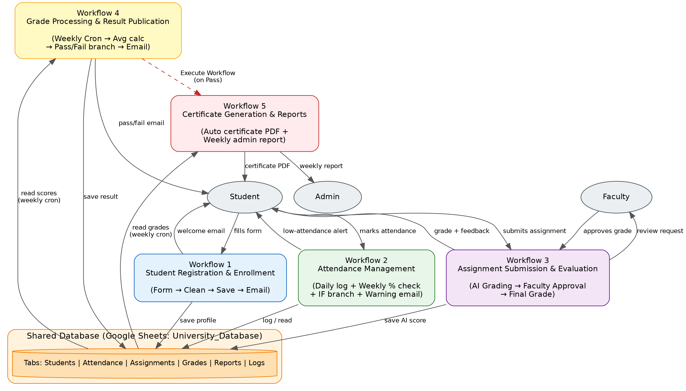

# Smart University Management Platform

An n8n-based automation platform. It automates the full academic administration lifecycle for a university — from student registration through attendance, AI-assisted assignment evaluation, result publication, and certificate generation — using five interconnected n8n workflows.

## Problem

Universities manage thousands of students across multiple programs, making manual handling of admissions, attendance, assignments, and results difficult to sustain. Faculty spend valuable time on repetitive administrative work instead of teaching. This project automates that lifecycle end-to-end while keeping faculty in control of final academic decisions.

See [`docs/Problem_Analysis.docx`](docs/Problem_Analysis.docx) for the full business context, stakeholders, pain points, and objectives.

## Architecture



All five workflows read from and write to a single shared Google Sheets database (`University_Database`), which acts as the system of record.

## Workflows

| # | Workflow | Trigger(s) | What it does |
|---|----------|-----------|---------------|
| 1 | **Student Registration & Enrollment** | Google Form (webhook-style) | Captures new student details, cleans them, saves to `Students`, sends a welcome email. |
| 2 | **Attendance Management** | Daily form + Weekly Cron | Logs daily attendance; weekly job calculates attendance % per student and emails a warning if below 75%. |
| 3 | **Assignment Submission & Evaluation** | Form (submission) + Form (faculty approval) | Extracts submitted assignment text, evaluates it with AI (Groq / Llama 3.3), routes the AI's suggested grade to faculty for approval, then notifies the student of their final grade. |
| 4 | **Grade Processing & Result Publication** | Weekly Cron | Aggregates each student's graded assignments, calculates their average, determines Pass/Fail, and emails the result. Calls Workflow 5 for students who pass. |
| 5 | **Certificate Generation & Reports** | Called by Workflow 4 (Execute Workflow) + Weekly Cron | Generates a personalized certificate (Google Docs → PDF) and emails it to passing students; sends a weekly performance summary report to administrators. |

## Advanced Features Implemented

- **AI decision-making** — Workflow 3 (AI grading via Groq) and Workflow 4 (pass/fail calculation)
- **Human approval step** — Workflow 3, faculty review before a grade is finalized
- **Scheduled (Cron) workflows** — Workflows 2, 4, and 5
- **Webhook / form-triggered workflows** — Workflows 1, 2, 3, and 5
- **Conditional branching** — IF nodes for attendance threshold and pass/fail logic
- **Cross-workflow orchestration** — Workflow 4 calls Workflow 5 via Execute Workflow
- **Logging / audit trail** — every workflow writes to a shared, timestamped Google Sheets database

## Tech Stack

- **Automation**: [n8n](https://n8n.io) (self-hosted, free tier)
- **Database**: Google Sheets (`University_Database`)
- **AI**: Groq API (Llama 3.3 70B) via n8n's OpenAI-compatible node
- **Notifications**: Gmail
- **Forms**: Google Forms
- **Documents**: Google Docs + Google Drive (certificate generation)

## Repository Structure

```
├── workflows/                     # Exported n8n workflow JSON files
│   ├── workflow-1-registration.json
│   ├── workflow-2-attendance.json
│   ├── workflow-3-assignment-evaluation.json
│   ├── workflow-4-grade-processing.json
│   └── workflow-5-certificates-reports.json
├── docs/
│   ├── Problem_Analysis.docx
│   ├── architecture.png
│   └── Smart_University_Presentation.pptx
└── README.md
```

## Setup Instructions

1. **Install n8n** (self-hosted, free):
   ```bash
   npm install n8n -g
   n8n start
   ```
   Open `http://localhost:5678`.

2. **Import the workflows**: in n8n, go to Workflows → Import from File, and upload each `.json` file from the `workflows/` folder.

3. **Reconnect credentials** (not included in the exports for security):
   - Google account (Sheets, Drive, Docs, Forms, Gmail) — OAuth via n8n's credential screen
   - Groq API key — get one free at [console.groq.com](https://console.groq.com), and set the OpenAI-node credential's Base URL to `https://api.groq.com/openai/v1`

4. **Set up the Google Sheets database**: create a spreadsheet named `University_Database` with tabs: `Students`, `Attendance`, `Assignments`, `Grades`, `Reports`, `Logs`.

5. **Set up the Google Forms**: Student Registration, Daily Attendance, Assignment Submission, and Faculty Grade Approval — link each form's responses to the corresponding trigger in its workflow.

6. **Activate each workflow** (Publish, in n8n's newer UI).

## Author

Nishtha — N8N workflow automation (Smart University Management Platform)
